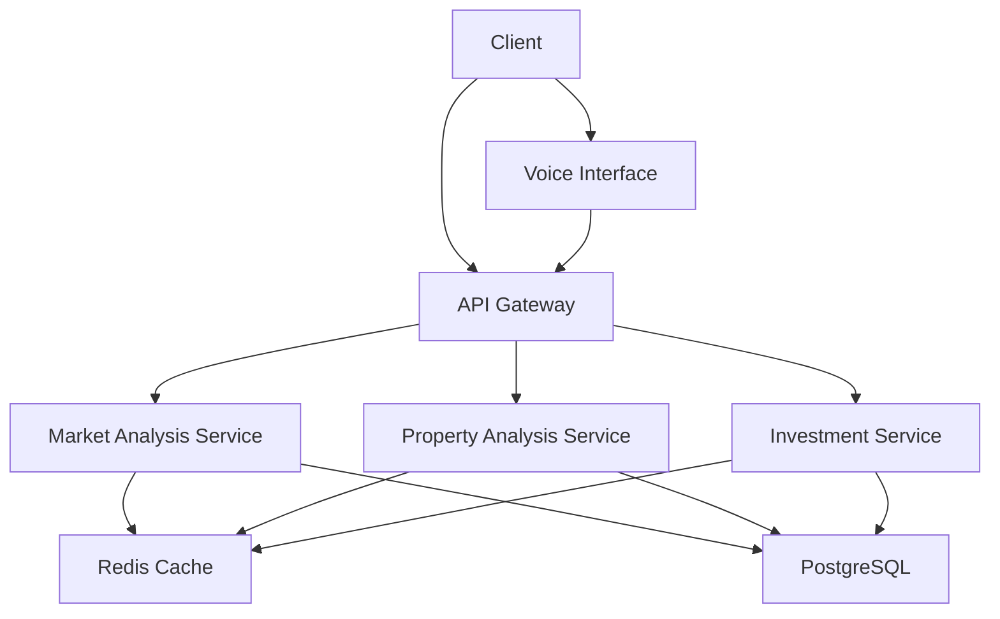

# Architecture Guide

## System Overview

The Real Estate AI Analysis Platform is built on a modern microservices architecture, emphasizing scalability, maintainability, and real-time processing capabilities.

## Core Components

### 1. API Gateway
- Request routing and load balancing
- Authentication and authorization
- Rate limiting and throttling
- Request/response transformation
- Monitoring and logging

### 2. Voice Interface Service
- Speech recognition
- Natural language processing
- Context management
- Text-to-speech synthesis
- Conversation flow management

### 3. Market Analysis Service
- Real-time market data processing
- Trend analysis and predictions
- Neighborhood scoring
- Investment opportunity detection
- Historical data analysis

### 4. Property Analysis Service
- Property valuation
- Comparative market analysis
- Risk assessment
- Feature extraction
- Document processing

### 5. Investment Service
- Portfolio optimization
- Risk management
- ROI calculations
- Investment recommendations
- Market timing analysis

## Data Flow

1. Client requests enter through API Gateway or Voice Interface
2. Requests are authenticated and rate-limited
3. Gateway routes to appropriate service
4. Services check cache for data
5. If cache miss, services fetch and process data
6. Results are cached for future use
7. Response returned to client

## Caching Strategy

### Redis Implementation
- Compressed data storage
- TTL-based expiration
- Cache invalidation on updates
- Circuit breaker pattern
- Cache warming for popular queries

### Caching Levels
1. Raw data cache
2. Processed results cache
3. API response cache
4. Session cache
5. Rate limit cache

## Database Design

### PostgreSQL Schema
- Properties
- Market Data
- Users
- Analytics
- Audit Logs

### Data Partitioning
- By geography
- By time range
- By data type
- By user segment

## Security Architecture

### Authentication
- JWT tokens
- API keys
- OAuth2 integration
- Rate limiting
- IP whitelisting

### Data Protection
- Encryption at rest
- TLS in transit
- PII handling
- Audit logging
- Access control

## Monitoring and Observability

### Metrics Collection
- Request rates
- Error rates
- Response times
- Cache hit rates
- Resource usage

### Logging
- Structured logging
- Log aggregation
- Error tracking
- Audit trails
- Performance profiling

## Deployment Architecture

### Container Orchestration
- Docker containers
- Kubernetes clusters
- Auto-scaling
- Health checks
- Rolling updates

### CI/CD Pipeline
- Automated testing
- Security scanning
- Performance testing
- Deployment automation
- Rollback capability

## Scalability Considerations

### Horizontal Scaling
- Stateless services
- Load balancing
- Database sharding
- Cache distribution
- Message queuing

### Vertical Scaling
- Resource optimization
- Memory management
- Connection pooling
- Query optimization
- Batch processing

## Error Handling

### Strategies
- Circuit breakers
- Retry mechanisms
- Fallback options
- Graceful degradation
- Error reporting

### Recovery Procedures
- Automated recovery
- Manual intervention
- Data reconciliation
- Service restoration
- Incident reporting

## Future Considerations

### Planned Improvements
- GraphQL API
- Real-time websockets
- Machine learning pipeline
- Data lake integration
- Mobile SDK

### Technical Debt
- Code coverage
- Documentation
- Performance optimization
- Security hardening
- API versioning
