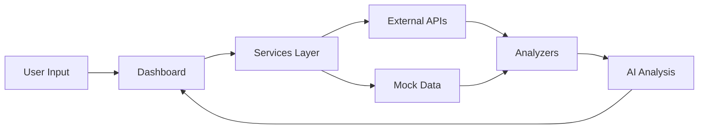

# Getting Started Guide

## 1. Technology Stack Overview

### Frontend (Dashboard)
- **Streamlit**: An open-source Python library for creating web apps
  - No signup required for local development
  - For deployment, visit [Streamlit Cloud](https://streamlit.io/cloud) and sign in with GitHub
  - Free tier available for personal projects

### Backend Components
```
src/
├── services/          # API Integrations
│   ├── mock_data.py  # Mock data for development
│   └── market/       # Real estate market data services
├── analyzers/        # Data Analysis
│   ├── property.py   # Property analysis
│   └── transit.py    # Transit scoring
└── signals/          # Market Signals
    ├── permits.py    # Building permits
    └── crime.py      # Crime statistics
```

## 2. How to Run the Project

### Local Development
1. Install Python 3.8+ if not already installed
2. Install dependencies:
```bash
pip install -r requirements.txt
```
3. Run the dashboard:
```bash
streamlit run dashboard.py
```
4. Open browser at: http://localhost:8501

### Production Deployment Options

#### 1. Streamlit Cloud (Easiest)
- Connect your GitHub repository
- Select repository and branch
- Click deploy
- Your app will be live at: https://your-app-name.streamlit.app

#### 2. Custom Server
- Install requirements
- Set up nginx/Apache
- Use systemd service
- Configure SSL

## 3. Configuration System

### Environment Variables (.env)
```
OPENAI_API_KEY=your-key
GOOGLE_MAPS_API_KEY=your-key
...other API keys
```

### Config Files
- `config/mock_config.py`: Development settings
- `config/settings.py`: Production settings

## 4. Data Flow



## 5. Key Components Explained

### Services Layer
- Handles all external API calls
- Currently using mock data for development
- Easy to switch between mock and real APIs

### Analyzers
- Process raw data into insights
- Calculate scores and metrics
- Generate recommendations

### Signals
- Track market indicators
- Monitor trends
- Generate alerts

## 6. Development Workflow

1. **Local Development**
   - Use mock data (`mock_data.py`)
   - Run with `streamlit run dashboard.py`
   - Changes reflect immediately

2. **Testing Real APIs**
   - Update `.env` with API keys
   - Modify `config/settings.py`
   - Switch features in dashboard

3. **Deployment**
   - Push to GitHub
   - Deploy on Streamlit Cloud or custom server

## 7. API Integration Status

| API | Status | Notes |
|-----|--------|-------|
| Zillow | Mock Ready | Requires API key |
| Realtor.com | Mock Ready | Requires API key |
| Census Bureau | Mock Ready | Free API |
| Walk Score | Mock Ready | Requires API key |
| Google Maps | Mock Ready | Requires API key |
| FBI Crime | Mock Ready | Free API |
| OpenCage | Mock Ready | Requires API key |
| Transitland | Mock Ready | Free tier available |

## 8. Next Steps

1. **Get API Keys**
   - Sign up for required services
   - Add keys to `.env` file
   - Test each integration

2. **Choose Deployment**
   - Streamlit Cloud (recommended for start)
   - Custom server (more control)

3. **Development**
   - Replace mock data with real APIs
   - Enhance analysis features
   - Add more visualizations

## 9. Common Issues & Solutions

### Dashboard Not Loading
```bash
# Check Python version
python --version  # Should be 3.8+

# Check Streamlit installation
pip show streamlit

# Clear cache
streamlit cache clear
```

### API Integration Issues
```python
# Test API connection
python -c "from src.services.mock_data import mock_data_service; print(mock_data_service.get_property_data('90210'))"
```

## 10. Useful Commands

```bash
# Run dashboard
streamlit run dashboard.py

# Run with specific port
streamlit run dashboard.py --server.port 8502

# Run with specific config
streamlit run dashboard.py --config config/local.yaml
```

Need more help? Check the [official Streamlit documentation](https://docs.streamlit.io/) or [open an issue](https://github.com/your-repo/issues)
