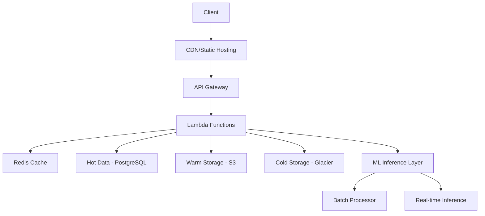

# Cost-Efficient Architecture Design

## Overview

This document outlines our cost-optimized architecture that maintains high performance while minimizing infrastructure costs.



## Infrastructure Components

### 1. Frontend Layer
- **Static Hosting (Netlify/Vercel)**
  - Cost: ~$0-19/month
  - Features: CDN, SSL, CI/CD
  - Auto-scaling included

```javascript
// next.config.js
module.exports = {
  staticPageGenerationTimeout: 120,
  images: {
    domains: ['cdn.realestate.ai'],
    minimumCacheTTL: 3600,
  },
  experimental: {
    optimizeCss: true,
    optimizeImages: true,
  }
}
```

### 2. API Layer
- **AWS Lambda/GCP Functions**
  - Pay per invocation
  - Auto-scaling
  - Zero idle costs

```python
# handler.py
from typing import Dict, Any

def api_handler(event: Dict[str, Any], context: Any) -> Dict[str, Any]:
    """
    Main API handler for serverless functions
    """
    try:
        # Get cache key
        cache_key = generate_cache_key(event)
        
        # Check cache first
        cached_result = await cache.get(cache_key)
        if cached_result:
            return {
                'statusCode': 200,
                'body': cached_result
            }
            
        # Process request
        result = await process_request(event)
        
        # Cache result
        await cache.set(cache_key, result, ttl=3600)
        
        return {
            'statusCode': 200,
            'body': result
        }
    except Exception as e:
        return {
            'statusCode': 500,
            'body': str(e)
        }
```

### 3. Data Storage Strategy

#### Hot Data (PostgreSQL)
- Active properties
- Recent transactions
- User data

```sql
-- Optimize indexes for frequent queries
CREATE INDEX idx_properties_location 
ON properties USING GIST (location);

CREATE INDEX idx_recent_transactions 
ON transactions (date DESC) 
WHERE date > NOW() - INTERVAL '30 days';
```

#### Warm Data (S3 Standard)
- Historical transactions
- Market trends
- Archived predictions

```python
class DataTierManager:
    async def get_data(self, data_id: str) -> Dict[str, Any]:
        """
        Smart data fetching from appropriate tier
        """
        # Try cache first
        cached = await self.cache.get(data_id)
        if cached:
            return cached
            
        # Check hot storage
        hot_data = await self.hot_storage.get(data_id)
        if hot_data:
            await self.cache.set(data_id, hot_data, ttl=3600)
            return hot_data
            
        # Check warm storage
        warm_data = await self.warm_storage.get(data_id)
        if warm_data:
            # Move to hot if frequently accessed
            if await self.is_frequently_accessed(data_id):
                await self.hot_storage.store(data_id, warm_data)
            return warm_data
            
        # Fallback to cold storage
        return await self.cold_storage.get(data_id)
```

#### Cold Data (Glacier)
- Multi-year historical data
- Archived analysis results
- Backup data

### 4. Caching Strategy

```python
class CacheManager:
    def __init__(self):
        self.redis = Redis(
            host=config.REDIS_HOST,
            port=config.REDIS_PORT,
            max_connections=20  # Limit connections for cost
        )
        
    async def get_market_analysis(self, location: str) -> Dict[str, Any]:
        """
        Smart caching for market analysis
        """
        cache_key = f"market:{location}"
        
        # Try cache first
        cached = await self.redis.get(cache_key)
        if cached:
            return json.loads(cached)
            
        # Calculate if not cached
        analysis = await self.calculate_market_analysis(location)
        
        # Cache with appropriate TTL based on data volatility
        ttl = self.get_dynamic_ttl(location)
        await self.redis.set(cache_key, json.dumps(analysis), ex=ttl)
        
        return analysis
        
    def get_dynamic_ttl(self, location: str) -> int:
        """
        Calculate TTL based on market volatility
        """
        volatility = self.get_market_volatility(location)
        if volatility > 0.8:
            return 1800  # 30 minutes
        elif volatility > 0.5:
            return 3600  # 1 hour
        return 7200  # 2 hours
```

### 5. ML Cost Optimization

```python
class MLOptimizer:
    def __init__(self):
        self.light_model = self.load_quantized_model('light')
        self.heavy_model = None  # Load only when needed
        
    async def predict(self, data: Dict[str, Any]) -> Dict[str, Any]:
        """
        Smart model selection based on complexity
        """
        complexity = self.assess_complexity(data)
        
        if complexity < 0.7:
            return await self.light_model.predict(data)
            
        # Load heavy model only if needed
        if not self.heavy_model:
            self.heavy_model = await self.load_model('heavy')
            
        return await self.heavy_model.predict(data)
        
    async def batch_process(self, items: List[Dict[str, Any]]) -> List[Dict[str, Any]]:
        """
        Batch processing for cost efficiency
        """
        results = []
        batch_size = 100
        
        for i in range(0, len(items), batch_size):
            batch = items[i:i + batch_size]
            results.extend(await self.process_batch(batch))
            
        return results
```

## Cost Optimization Strategies

### 1. Dynamic Scaling
- Scale based on actual usage patterns
- Implement automatic warm-up/cool-down
- Use spot instances for batch processing

### 2. Data Lifecycle Management
- Automatic tiering based on access patterns
- Compression for stored data
- Regular cleanup of unnecessary data

### 3. Resource Limits
- Set hard limits on resource usage
- Implement circuit breakers
- Monitor and alert on cost thresholds

## Monitoring and Optimization

```python
class CostMonitor:
    async def monitor_resources(self):
        """
        Monitor resource usage and costs
        """
        metrics = await self.gather_metrics()
        
        if metrics['cost_rate'] > THRESHOLD:
            await self.optimize_resources()
            await self.notify_team()
            
    async def optimize_resources(self):
        """
        Automatic resource optimization
        """
        # Scale down unused resources
        await self.scale_down_inactive()
        
        # Move cold data to cheaper storage
        await self.optimize_storage()
        
        # Adjust cache sizes
        await self.optimize_cache()
```

## Implementation Phases

1. **Phase 1: Core Infrastructure**
   - Static frontend
   - Basic API layer
   - Essential data storage

2. **Phase 2: Optimization**
   - Caching implementation
   - Storage tiering
   - ML optimization

3. **Phase 3: Advanced Features**
   - Real-time processing
   - Advanced analytics
   - Custom ML models

## Cost Estimates

| Component | Monthly Cost (Est.) |
|-----------|-------------------|
| Frontend  | $0-19            |
| API Layer | $50-200          |
| Database  | $20-100          |
| Storage   | $10-50           |
| ML/AI     | $100-500         |
| **Total** | **$180-869**     |

## Next Steps

1. Implement basic infrastructure
2. Set up monitoring
3. Deploy initial version
4. Optimize based on real usage patterns
