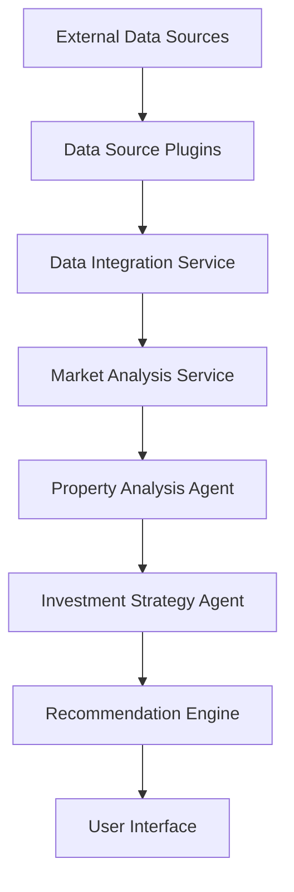

# Real Estate AI System Architecture Overview

## System Overview

The Real Estate AI System is a modular, extensible platform that helps businesses analyze properties, make investment decisions, and automate real estate operations.

## Core Components

### 1. Task Orchestrator (`src/utils/task_orchestrator.py`)
- Manages asynchronous task execution
- Handles task prioritization and scheduling
- Provides error handling and retry mechanisms
- Key features:
  - Task queuing
  - Priority-based execution
  - Concurrent task management
  - Error recovery

### 2. Service Manager (`src/services/service_manager.py`)
- Manages core service lifecycle
- Coordinates service dependencies
- Handles service health monitoring
- Services include:
  - Data integration
  - Market analysis
  - Property valuation
  - Investment analysis

### 3. Agent Manager (`src/agents/agent_manager.py`)
- Coordinates AI agents
- Manages agent communication
- Handles task distribution
- Supported agents:
  - Property Analysis Agent
  - Data Integration Agent
  - Market Research Agent
  - Investment Strategy Agent

### 4. Plugin System (`src/core/plugin_system.py`)
- Enables system extensibility
- Manages plugin lifecycle
- Handles plugin dependencies
- Plugin types:
  - Data Source Plugins
  - ML Model Plugins
  - Processor Plugins

### 5. Configuration Manager (`src/core/config_manager.py`)
- Manages system configuration
- Handles hot-reloading
- Validates configurations
- Features:
  - JSON schema validation
  - Environment-specific configs
  - Dynamic updates

## Data Flow



## Plugin Architecture

### Data Source Plugins
1. **Zillow Data Source**
   - Property listings
   - Market trends
   - Price history
   - Neighborhood data

2. **MLS Integration**
   - Real-time listings
   - Property details
   - Agent information
   - Transaction history

### ML Model Plugins
1. **Property Valuation Model**
   - Price prediction
   - Value analysis
   - Risk assessment
   - Features:
     - Market-based pricing
     - Comparable analysis
     - Trend prediction

2. **Property Recommender**
   - Investment recommendations
   - Similar properties
   - Market opportunities
   - Features:
     - Collaborative filtering
     - Content-based filtering
     - Hybrid recommendations

## Service Architecture

### 1. Data Integration Service
- Data normalization
- Source integration
- Data validation
- Caching system

### 2. Market Analysis Service
- Trend analysis
- Market indicators
- Competitive analysis
- Risk assessment

### 3. Investment Analysis Service
- ROI calculation
- Risk modeling
- Strategy optimization
- Portfolio analysis

## Agent Architecture

### 1. Property Analysis Agent
- Feature extraction
- Value assessment
- Risk evaluation
- Market positioning

### 2. Investment Strategy Agent
- Strategy generation
- Risk management
- Portfolio optimization
- Market timing

## Security Architecture

### 1. Authentication
- JWT-based auth
- Role-based access
- API key management
- Session handling

### 2. Data Protection
- Encryption at rest
- Secure transmission
- Access logging
- Audit trails

## Deployment Architecture

### 1. Infrastructure
- Containerized services
- Load balancing
- Auto-scaling
- Health monitoring

### 2. Data Storage
- Time-series data
- Document storage
- Cache layer
- Backup system

## API Architecture

### 1. REST APIs
- Property management
- User management
- Plugin management
- Analysis endpoints

### 2. WebSocket APIs
- Real-time updates
- Market alerts
- System notifications
- Live analytics

## User Interface

### 1. Plugin Manager UI
- Plugin configuration
- Status monitoring
- Performance metrics
- Error reporting

### 2. Analysis Dashboard
- Market insights
- Property analysis
- Investment tracking
- Portfolio management

## Development Guidelines

### 1. Code Organization
- Feature-based structure
- Clean architecture
- Dependency injection
- Interface segregation

### 2. Testing Strategy
- Unit testing
- Integration testing
- E2E testing
- Performance testing

### 3. Documentation
- API documentation
- Plugin development guide
- Architecture guide
- User manuals

## Future Roadmap

### 1. Planned Features
- Advanced ML models
- More data sources
- Enhanced analytics
- Mobile applications

### 2. Scalability Plans
- Multi-region support
- Enhanced caching
- Distributed processing
- Real-time analytics

## Getting Started

1. **Installation**
```bash
git clone <repository>
cd wholesale
pip install -r requirements.txt
```

2. **Configuration**
```bash
cp config/example.yaml config/local.yaml
# Edit local.yaml with your settings
```

3. **Running the System**
```bash
python src/main.py
```

4. **Development**
```bash
# Create virtual environment
python -m venv venv
source venv/bin/activate  # Unix
venv\Scripts\activate     # Windows

# Install dev dependencies
pip install -r requirements-dev.txt
```

## Support and Resources

- GitHub repository
- Documentation wiki
- Issue tracker
- Community forum
